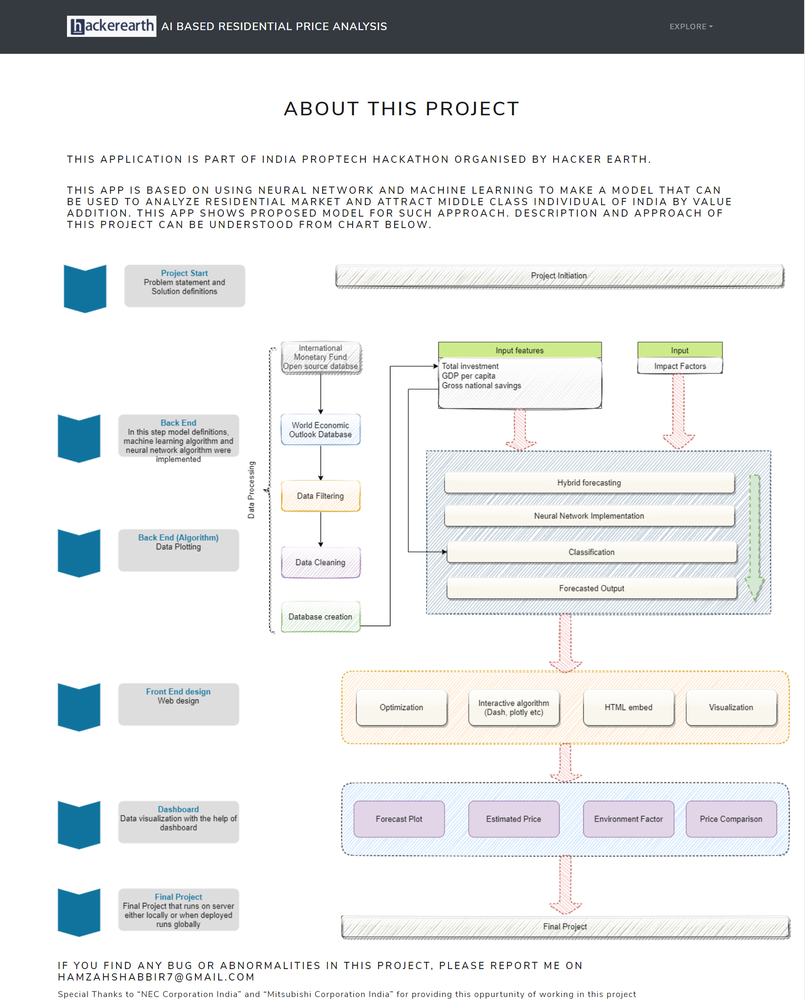

    
# AI Based Residential Price Analysis

Model proposal based on Neural Network for standardization of residential worth by categorizing different impact factors for value addition of residential markets as well as consumer

This project was part of All India PropTech Hackathon by NEC & Mitsubishi in which I was runner up.

* Proposal of a model that is based on Deep Neural Network that considers various factors that has direct or indirect impact on worth of residential property
* Model will also include forecasting model to predict future price of property
* Common platform (Web app) for interaction of developer with buyer
* At the end there will be a web app integrated with Neural network model and machine learning model that will give following output:
* Estimated price range of residential property
* Forecasted Price in future
* Net profit of investment (when to invest, when to sell )
* Graphical and map representation for price comparison
* Environmental scale (can be used to attract buyer)
* Social Scale (can be used to attract buyer)

## Forecasting method
Forecasting consists of hybrid model of machine learning(Random Forest) and time seris forecasting (AutoRegressive Integrated Moving Average). This model will estimate price in future considering past trend and some macro features.

## Forecasting outputs
Forecasting out can give average forecasted price in different regions of India with graphical represenatations.
Other output will be prediction of price.

## Neural Network model

## Screenshots

## Authors

- [@hamzahshabbir](https://github.com/hamzahshabbir96)

  
## Acknowledgements

 - [hacker earth](hackerearth.com)
 - [NEC Corporation India Private Limited](https://in.nec.com/)
 - [Mitsubishi Corporation India](https://www.mitsubishicorp.com/)

  
## Feedback

If you have any feedback, please reach out to us at hamzahshabbir7@gmail.com

  
## 🔗 Links

  

